# 🌏 South Indian Multilingual Document QA Chatbot

A production-grade Streamlit application that enables users to upload documents in South Indian languages (Malayalam, Tamil, Telugu, Kannada, Tulu) and ask questions about them using advanced RAG (Retrieval-Augmented Generation) technology powered by Groq LLMs and Qdrant vector database.

## ✨ Features

- **Multilingual Support**: Automatically detects and processes documents in Malayalam, Tamil, Telugu, Kannada, and Tulu
- **Document Processing**: Supports PDF, DOCX, and TXT file formats
- **Advanced RAG Pipeline**: Uses sentence-transformers for multilingual embeddings and Qdrant for vector storage
- **Groq LLM Integration**: Powered by state-of-the-art models like Mixtral-8x7B and Llama3-70B
- **Language-Aware Responses**: Always responds in the same language as the uploaded document
- **Clean UI**: Modern Streamlit interface with chat functionality

## 🏗️ Architecture

```mermaid
graph TD
    A["📄 User Uploads Document<br/>(PDF, DOCX, TXT)"] --> B["🔍 Language Detection<br/>(Malayalam, Tamil, Telugu,<br/>Kannada, Tulu)"]
    B --> C["📝 Text Extraction<br/>(Clean & Process)"]
    C --> D["✂️ Smart Chunking<br/>(800 chars with overlap)"]
    D --> E["🧠 AI Embeddings<br/>(Multilingual Model)"]
    E --> F["💾 Vector Storage<br/>(In-Memory or Qdrant)"]
    
    G["❓ User Asks Question"] --> H["🔍 Query Embedding<br/>(Same AI Model)"]
    H --> I["🎯 Smart Search<br/>(Find Relevant Chunks)"]
    I --> J["📚 Context Assembly<br/>(Top 5 Best Matches)"]
    J --> K["🤖 Groq AI Response<br/>(Llama 3.1 Model)"]
    K --> L["🌏 Multilingual Answer<br/>(Same Language as Document)"]
    
    F -.-> I
    
    style A fill:#e1f5fe
    style B fill:#f3e5f5
    style C fill:#e8f5e8
    style D fill:#fff3e0
    style E fill:#fce4ec
    style F fill:#e0f2f1
    style G fill:#e1f5fe
    style H fill:#f3e5f5
    style I fill:#e8f5e8
    style J fill:#fff3e0
    style K fill:#fce4ec
    style L fill:#e0f2f1
```



### 🎯 How It Works (Simple Explanation)

1. **📄 Upload**: You upload a document in any South Indian language
2. **🔍 Detect**: The system automatically detects the language (Malayalam, Tamil, Telugu, Kannada, or Tulu)
3. **📝 Extract**: Text is extracted and cleaned from your document
4. **✂️ Chunk**: The text is broken into smart pieces for better understanding
5. **🧠 Learn**: AI creates "fingerprints" (embeddings) of each piece
6. **💾 Store**: These fingerprints are stored for quick retrieval
7. **❓ Question**: When you ask a question, the system finds the most relevant pieces
8. **🤖 Answer**: Groq AI generates a comprehensive answer in the same language as your document

**The magic happens in steps 5-7**: The AI understands the meaning of your question and finds the most relevant parts of your document to give you accurate answers!

## 📋 Prerequisites

- Python 3.8 or higher
- Groq API key (get from [Groq Console](https://console.groq.com/keys))
- Qdrant instance (local or cloud)

## 🚀 Quick Start

### 1. Clone and Setup

```bash
git clone <repository-url>
cd doc_llm
```

### 2. Install Dependencies

```bash
pip install -r requirements.txt
```

### 3. Setup Qdrant

#### Option A: Local Qdrant (Recommended for development)

```bash
# Using Docker
docker run -p 6333:6333 qdrant/qdrant

# Or using pip
pip install qdrant-client
```

#### Option B: Qdrant Cloud

1. Sign up at [Qdrant Cloud](https://cloud.qdrant.io/)
2. Create a cluster
3. Get your cluster URL and API key

### 4. Configure Environment

```bash
# Copy the example environment file
cp env.example .env

# Edit .env with your actual values
GROQ_API_KEY=your_actual_groq_api_key
QDRANT_URL=http://localhost:6333  # or your cloud URL
```

**⚠️ Important**: Replace `your_groq_api_key_here` with your actual Groq API key from [Groq Console](https://console.groq.com/keys)

### 5. Run the Application

```bash
streamlit run main.py
```

The application will be available at `http://localhost:8501`

## 🔧 Configuration

### Environment Variables

| Variable | Description | Default |
|----------|-------------|---------|
| `GROQ_API_KEY` | Your Groq API key | Required |
| `QDRANT_URL` | Qdrant server URL | `http://localhost:6333` |
| `GROQ_MODEL` | Groq model to use | `mixtral-8x7b-32768` |
| `QDRANT_COLLECTION_NAME` | Collection name in Qdrant | `multilingual_docs` |

### Available Groq Models

- `mixtral-8x7b-32768` (Recommended)
- `llama3-70b-8192`
- `llama3-8b-8192`
- `gemma-7b-it`

## 📁 Project Structure

```
doc_llm/
├── main.py                 # Streamlit frontend application
├── rag_pipeline.py         # RAG pipeline with Qdrant integration
├── llm_handler.py          # Groq API handler
├── utils.py               # Utility functions (text extraction, language detection)
├── requirements.txt       # Python dependencies
├── env.example           # Environment configuration template
└── README.md             # This file
```

## 🎯 Usage Examples

### Malayalam Document
1. Upload a Malayalam PDF: `കേരള ടൂറിസം 2025.pdf`
2. System detects: Malayalam
3. Ask: "കേരള ടൂറിസം നയത്തിന്റെ പ്രധാന ലക്ഷ്യങ്ങൾ എന്തൊക്കെയാണു?"
4. Get response in Malayalam

### Tamil Document
1. Upload: `தமிழ் இலக்கிய வரலாறு.docx`
2. Ask: "திருக்குறளின் ஆசிரியர் யார்?"
3. Get response in Tamil

## 🛠️ Technical Details

### Language Detection
- Uses `langdetect` library with character pattern recognition
- Supports Malayalam, Tamil, Telugu, Kannada, and Tulu
- Fallback to English for unsupported languages

### Text Processing
- **PDF**: Uses `pdfplumber` for reliable text extraction
- **DOCX**: Uses `docx2txt` for Word document processing
- **TXT**: Supports multiple encodings (UTF-8, UTF-16, Latin-1)

### Embeddings
- Model: `sentence-transformers/paraphrase-multilingual-MiniLM-L12-v2`
- Dimension: 384
- Supports 50+ languages including all South Indian languages

### Vector Storage
- **Database**: Qdrant vector database
- **Distance Metric**: Cosine similarity
- **Chunking**: 500-character chunks with 50-character overlap

### LLM Integration
- **Provider**: Groq API
- **Model**: Mixtral-8x7B (default)
- **Temperature**: 0.1 (for consistent responses)
- **Max Tokens**: 1000

## 🔍 Troubleshooting

### Common Issues

1. **"Groq API key is required"** ❌
   - **Solution**: Create a `.env` file with your API key
   - **Steps**: 
     ```bash
     cp env.example .env
     # Edit .env and replace your_groq_api_key_here with your actual key
     ```
   - **Verify**: Check that `.env` file exists and contains `GROQ_API_KEY=your_actual_key`

2. **"ModuleNotFoundError: No module named 'utils'"**
   - Ensure all files are in the same directory
   - Check Python path

3. **"Connection to Qdrant failed"**
   - Ensure Qdrant is running on the specified URL
   - Check firewall settings
   - **Note**: App will automatically use in-memory storage if Qdrant is unavailable

4. **"Language detection failed"**
   - Ensure document has sufficient text (>20 characters)
   - Check if language is supported

5. **"Could not extract sufficient text from the document"**
   - Try a different PDF format
   - Ensure the PDF contains readable text (not just images)
   - Check if the document is corrupted

### Performance Optimization

1. **Faster Embeddings**: Use GPU if available
2. **Memory Usage**: Adjust chunk size based on available RAM
3. **Response Time**: Use smaller models for faster responses

## 🤝 Contributing

1. Fork the repository
2. Create a feature branch
3. Make your changes
4. Add tests if applicable
5. Submit a pull request

## 📄 License

This project is licensed under the MIT License - see the LICENSE file for details.

## 🙏 Acknowledgments

- [Streamlit](https://streamlit.io/) for the web framework
- [Groq](https://groq.com/) for the LLM API
- [Qdrant](https://qdrant.tech/) for the vector database
- [Sentence Transformers](https://www.sbert.net/) for multilingual embeddings
- [LangDetect](https://github.com/Mimino666/langdetect) for language detection

## 📞 Support

For issues and questions:
- Create an issue in the repository
- Check the troubleshooting section
- Review the documentation

---

Built with ❤️ for the South Indian language community
